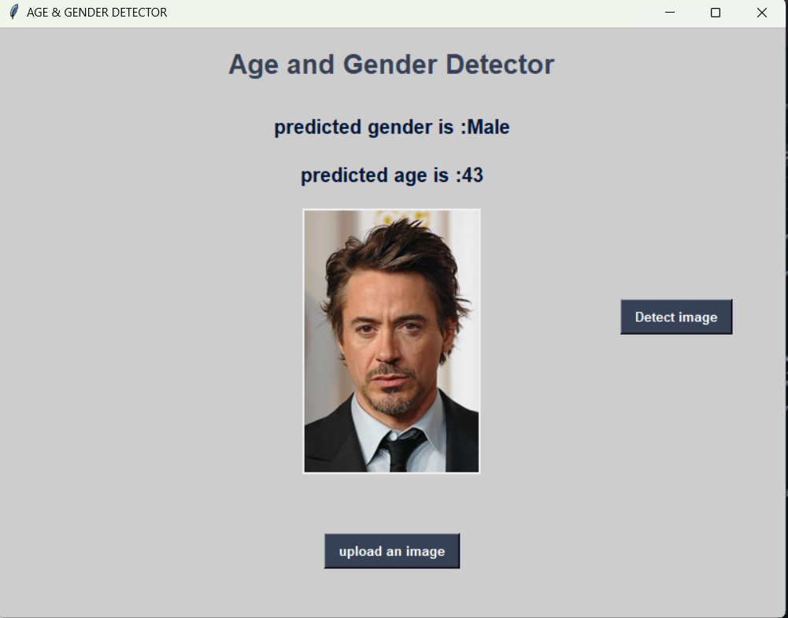

# Age_gender_detector
A simple age and gender detector model using python
 ## To simply run this model
 1. Clone this repository
2. run the [gui.py](GUI.ipynb) file
3. Upload the Image you wanr to detect
4. Click on detect button
5. view the result

## To run the model yourself
1. CLone the repository
2. Download the dataset from [here](https://www.kaggle.com/datasets/jangedoo/utkface-new).
3. Extract dataset to your repository folder.
4. Open the [Model Jupyter notebook](Age_Gender_Prediction.ipynb)
5. Run this notebook
6. Run the [gui.py](GUI.ipynb) file
7. Upload the image you want to detect
8. Click on detect button
9. View results 

##Sample output

